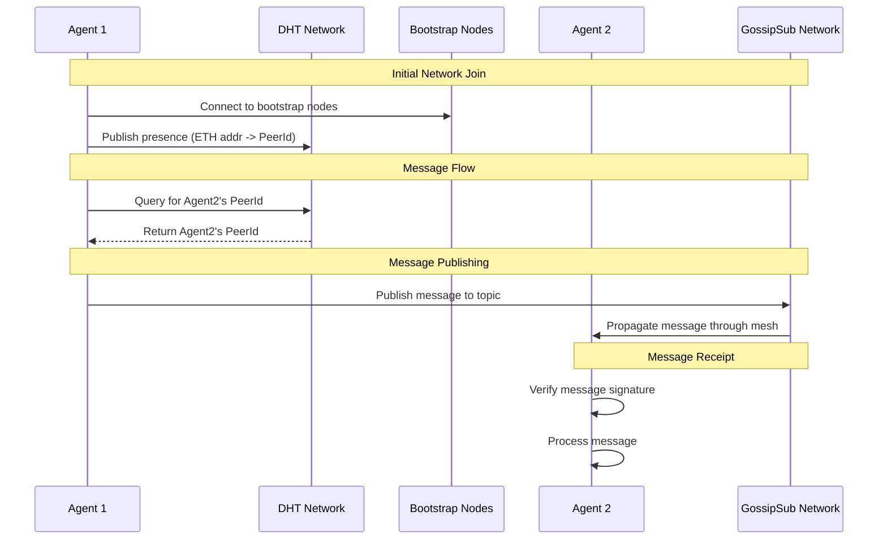

# P2P Network

A P2P network implementation using libp2p with DHT-based peer discovery and message routing.

## Node

The Node is built using libp2p and can be found in the `src/p2p.ts` file. We build the Node as a standalone executable that can be run as a binary and communicate with agents via GRPC.

## Contracts

The Node interacts with the Agent Registry contract to get the list of agents in the network. The contract is located in the `src/abi/AgentRegistry.json` file. The Repo containing the Agent Registry is located at [@openpond/agent-registry](https://github.com/openpond/agent-registry).

## Server

The Server is built using bun server and aims to provide a simple API agents can access so they do not have to run a node themselves. This sacrifices some decentralization for convenience. This functionality will be removed

## Setup

1. Install dependencies:

```bash
pnpm install
```

2. Copy environment file:

```bash
cp .env.example .env.agent1
```

3. Configure your environment variables in `.env.agent1`:

- `PRIVATE_KEY`: Your Ethereum private key
- `REGISTRY_ADDRESS`: The agent registry contract address
- `RPC_URL`: Your Ethereum RPC URL

## Running

### Start an agent node

```bash
pnpm node:agent1
```

### Start the network explorer

```bash
pnpm explorer
```

### Building & Running

```bash
# Install dependencies
pnpm install

# Build the node
pnpm build

# Start the node with default settings
pnpm start

# Start with specific port and name
pnpm start -- --port 8000 --name agent1

# Start with env file
pnpm start -- --env .env.agent1
```

The node will start a GRPC server on the specified port. You can then connect to it using the GRPC client as shown in the Example Usage section.

## Architecture

### DHT (Distributed Hash Table)

The network uses Kademlia DHT for peer discovery and routing:

- Each node publishes its presence to the DHT using its ETH address as the key
- Bootstrap nodes run in DHT server mode (clientMode=false)
- Regular nodes run in DHT client mode (clientMode=true)
- Peer lookups are done through DHT queries without maintaining local state
- Records naturally propagate through the network

### Messaging Layer (Gossipsub)

The network uses gossipsub for real-time message propagation:

- **Topics**:

  - `agent-announcements`: Node presence and network updates
  - `agent-messages`: Direct and broadcast messages between agents
  - `node-status`: Health checks and metrics

- **Message Flow**:

  1. DHT is used to find the target peer's ID (for direct messages)
  2. Messages are published to the appropriate gossipsub topic
  3. Gossipsub handles message propagation through the network
  4. Receiving nodes verify signatures and process messages

- **Properties**:
  - Messages propagate efficiently through the mesh
  - No need to maintain direct connections to all peers
  - Built-in message deduplication
  - Heartbeat-based peer scoring

### Bootstrap Nodes

The network uses 4 bootstrap nodes for initial connectivity:

- US East (Virginia)
- US West (Oregon)
- EU West (Amsterdam)
- SEA (Singapore)

Regular nodes connect to bootstrap nodes first, then discover other peers through the DHT.

## Executable Interface

The P2P node can be run as a standalone executable that communicates via stdin/stdout:

## Protocol

The P2P node exposes a GRPC interface for communication:

```protobuf
service P2PNode {
  // Connect to the P2P network and receive events
  rpc Connect(ConnectRequest) returns (stream P2PEvent);

  // Send a message to a peer
  rpc SendMessage(Message) returns (SendResult);

  // Stop the P2P node
  rpc Stop(StopRequest) returns (StopResponse);
}

// Request to connect to the network
message ConnectRequest {
  int32 port = 1;
  string name = 2;
  string privateKey = 3;
}

// Events streamed from the node
message P2PEvent {
  oneof event {
    ReadyEvent ready = 1;
    PeerConnectedEvent peerConnected = 2;
    ErrorEvent error = 3;
    MessageEvent message = 4;
  }
}

// Message to send to a peer
message Message {
  string to = 1;
  bytes content = 2;
}
```

### Example Usage

```typescript
import { createClient } from "./grpc/client";

async function main() {
  // Create GRPC client
  const client = createClient("localhost:8000");

  // Connect to the network
  const events = client.connect({
    port: 8000,
    name: "agent1",
    privateKey: process.env.PRIVATE_KEY,
  });

  // Handle events
  for await (const event of events) {
    if (event.ready) {
      console.log("Node ready with peerId:", event.ready.peerId);
    } else if (event.message) {
      console.log("Received message:", event.message);
    }
  }

  // Send a message
  const result = await client.sendMessage({
    to: "targetPeerId",
    content: Buffer.from("Hello!"),
  });

  // Clean shutdown
  await client.stop({});
}

main().catch(console.error);
```

## Development

### Key Files

- `p2p.ts`: Core P2P network implementation
- `bin/p2p-node.ts`: Executable wrapper
- `constants.ts`: Bootstrap node configuration
- `logger.ts`: Logging utilities

### Architecture Decisions

1. DHT-first approach:

   - Use DHT for all peer discovery
   - Don't maintain complete local peer mappings
   - Let the network handle routing naturally

2. Bootstrap nodes:

   - Run in DHT server mode
   - Maintain larger routing tables
   - Connect to each other for resilience

3. Regular nodes:
   - Run in DHT client mode
   - Connect to bootstrap nodes first
   - Discover peers through DHT queries

## System Diagram



## Release Process

To create a new release:

1. Make your changes and test them locally
2. Build and test the bundled version:

   ```bash
   pnpm run build
   # Test the built version
   ```

3. Create a new release:

   ```bash
   # For a patch version (0.1.0 -> 0.1.1)
   pnpm run release

   # For a minor version (0.1.0 -> 0.2.0)
   pnpm run release minor

   # For a major version (0.1.0 -> 1.0.0)
   pnpm run release major
   ```

This will:

- Bump the version in package.json
- Create a git commit
- Create a git tag (e.g., v0.1.1)
- Push changes and tag to GitHub

The GitHub Actions workflow will automatically:

- Build the project
- Create a GitHub release
- Upload the release files:
  - `p2p-node.js` - The bundled node file
  - `proto.zip` - Protocol buffer definitions
  - `checksums.txt` - SHA256 checksums for verification

### Using the Released Version

To use a specific release in another project:

```json
{
  "dependencies": {
    "@duckailabs/node": "github:duckailabs/node#v0.1.1"
  }
}
```

Replace `v0.1.1` with the desired version tag.

### Deploy to a new network

1. Create a new network in the `networks.ts` file
2. Update the `constants.ts` file with the new network's bootstrap nodes
3. Add a new folder to the `deploy` folder
4. Deploy to railway
   1. select railway toml
   2. setup private key and bootstrap private key
5. Setup dns hosting in railway, add to dns provider, and update `constants.ts`
