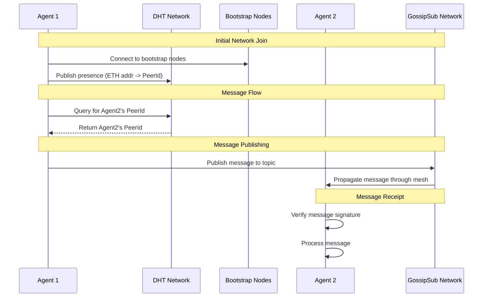

# P2P Network

A P2P network implementation using libp2p with DHT-based peer discovery and message routing.

## Setup

1. Install dependencies:

```bash
pnpm install
```

2. Copy environment file:

```bash
cp .env.example .env.agent1
```

3. Configure your environment variables in `.env.agent1`:

- `PRIVATE_KEY`: Your Ethereum private key
- `REGISTRY_ADDRESS`: The agent registry contract address
- `RPC_URL`: Your Ethereum RPC URL

## Running

### Start an agent node

```bash
pnpm node:agent1
```

### Start the network explorer

```bash
pnpm explorer
```

## Architecture

### DHT (Distributed Hash Table)

The network uses Kademlia DHT for peer discovery and routing:

- Each node publishes its presence to the DHT using its ETH address as the key
- Bootstrap nodes run in DHT server mode (clientMode=false)
- Regular nodes run in DHT client mode (clientMode=true)
- Peer lookups are done through DHT queries without maintaining local state
- Records naturally propagate through the network

### Messaging Layer (Gossipsub)

The network uses gossipsub for real-time message propagation:

- **Topics**:

  - `agent-announcements`: Node presence and network updates
  - `agent-messages`: Direct and broadcast messages between agents
  - `node-status`: Health checks and metrics

- **Message Flow**:

  1. DHT is used to find the target peer's ID (for direct messages)
  2. Messages are published to the appropriate gossipsub topic
  3. Gossipsub handles message propagation through the network
  4. Receiving nodes verify signatures and process messages

- **Properties**:
  - Messages propagate efficiently through the mesh
  - No need to maintain direct connections to all peers
  - Built-in message deduplication
  - Heartbeat-based peer scoring

### Network Explorer

The explorer provides a real-time view of the network:

- Connects directly to the P2P network using agent1's credentials
- Shows connected peers and DHT records
- Displays network map with bootstrap node locations
- Enables real-time chat with other agents
- Monitors network health and peer status

### Bootstrap Nodes

The network uses 4 bootstrap nodes for initial connectivity:

- US East (Virginia)
- US West (Oregon)
- EU West (Amsterdam)
- SEA (Singapore)

Regular nodes connect to bootstrap nodes first, then discover other peers through the DHT.

## Usage

### Sending Messages

Messages can be sent in two ways:

1. Broadcast to all peers: Just type your message
2. Direct message: Use `@<eth_address>` format (e.g., `@0x1234...`)

The network will automatically:

1. Look up the recipient's PeerId from their ETH address using the DHT
2. Route the message through the P2P network
3. Encrypt the message if encryption is enabled

### Network Status

The explorer shows:

- Connected peers
- DHT records
- Network map
- Real-time chat
- Log messages

## Development

### Key Files

- `p2p.ts`: Core P2P network implementation
- `agent-explorer.ts`: Network explorer UI
- `constants.ts`: Bootstrap node configuration
- `logger.ts`: Logging utilities

### Architecture Decisions

1. DHT-first approach:

   - Use DHT for all peer discovery
   - Don't maintain complete local peer mappings
   - Let the network handle routing naturally

2. Bootstrap nodes:

   - Run in DHT server mode
   - Maintain larger routing tables
   - Connect to each other for resilience

3. Regular nodes:

   - Run in DHT client mode
   - Connect to bootstrap nodes first
   - Discover peers through DHT queries

## System Diagram



This diagram shows the key steps:

1. Initial network join where an agent connects to bootstrap nodes and publishes its presence
2. DHT lookup process when an agent needs to find another peer
3. Message publishing through GossipSub
4. Message propagation and verification

The system uses DHT for peer discovery (mapping ETH addresses to PeerIds) and GossipSub for efficient message propagation. This hybrid approach gives us both reliable peer discovery and efficient real-time messaging.
