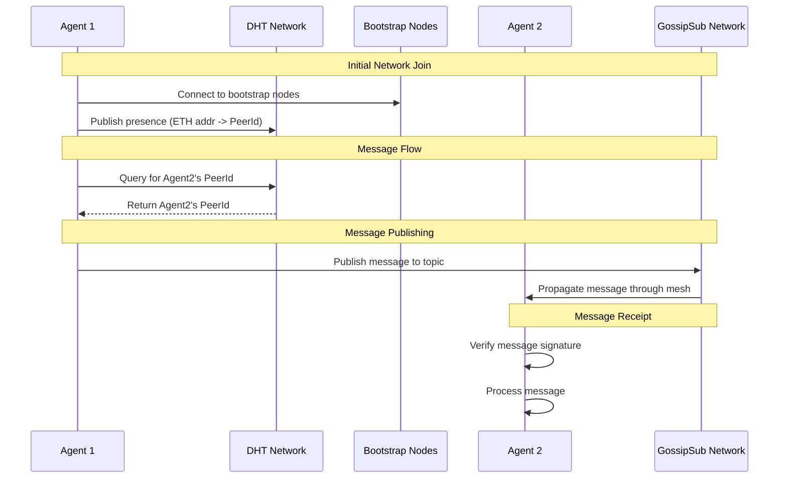

# P2P Network

A P2P network implementation using libp2p with DHT-based peer discovery and message routing.

## Setup

1. Install dependencies:

```bash
pnpm install
```

2. Copy environment file:

```bash
cp .env.example .env.agent1
```

3. Configure your environment variables in `.env.agent1`:

- `PRIVATE_KEY`: Your Ethereum private key
- `REGISTRY_ADDRESS`: The agent registry contract address
- `RPC_URL`: Your Ethereum RPC URL

## Running

### Start an agent node

```bash
pnpm node:agent1
```

### Start the network explorer

```bash
pnpm explorer
```

## Architecture

### DHT (Distributed Hash Table)

The network uses Kademlia DHT for peer discovery and routing:

- Each node publishes its presence to the DHT using its ETH address as the key
- Bootstrap nodes run in DHT server mode (clientMode=false)
- Regular nodes run in DHT client mode (clientMode=true)
- Peer lookups are done through DHT queries without maintaining local state
- Records naturally propagate through the network

### Messaging Layer (Gossipsub)

The network uses gossipsub for real-time message propagation:

- **Topics**:

  - `agent-announcements`: Node presence and network updates
  - `agent-messages`: Direct and broadcast messages between agents
  - `node-status`: Health checks and metrics

- **Message Flow**:

  1. DHT is used to find the target peer's ID (for direct messages)
  2. Messages are published to the appropriate gossipsub topic
  3. Gossipsub handles message propagation through the network
  4. Receiving nodes verify signatures and process messages

- **Properties**:
  - Messages propagate efficiently through the mesh
  - No need to maintain direct connections to all peers
  - Built-in message deduplication
  - Heartbeat-based peer scoring

### Bootstrap Nodes

The network uses 4 bootstrap nodes for initial connectivity:

- US East (Virginia)
- US West (Oregon)
- EU West (Amsterdam)
- SEA (Singapore)

Regular nodes connect to bootstrap nodes first, then discover other peers through the DHT.

## Executable Interface

The P2P node can be run as a standalone executable that communicates via stdin/stdout:

### Protocol

```typescript
// Input Commands (stdin)
type NodeCommand =
  | { type: "connect"; port: number; bootstrapPeers?: string[] }
  | { type: "send"; peerId: string; data: any }
  | { type: "discover"; topic: string }
  | { type: "subscribe"; topic: string }
  | { type: "shutdown" };

// Output Events (stdout)
type NodeEvent =
  | { type: "ready"; peerId: string }
  | { type: "message"; from: string; data: any }
  | { type: "peer_discovered"; peerId: string; topics: string[] }
  | { type: "error"; code: string; message: string }
  | {
      type: "log";
      level: string;
      namespace: string;
      message: string;
      meta?: any;
    };
```

### Building & Running

```bash
# Build the executable
pnpm build:exe

# Start with default settings
./dist/p2p-node

# Start with specific port and name
./dist/p2p-node -p 8000 -n agent1

# Start with env file
./dist/p2p-node -e .env.agent1
```

### Example Usage

```typescript
import { spawn } from "child_process";

// Start the node
const node = spawn("./dist/p2p-node", ["-p", "8000"]);

// Send commands
node.stdin.write(
  JSON.stringify({
    type: "connect",
    port: 8000,
  }) + "\n"
);

// Handle events
node.stdout.on("data", (data) => {
  const events = data.toString().split("\n").filter(Boolean);
  for (const event of events) {
    const parsed = JSON.parse(event);
    console.log("Received event:", parsed);
  }
});

// Clean shutdown
process.on("SIGTERM", () => {
  node.stdin.write(JSON.stringify({ type: "shutdown" }) + "\n");
});
```

### Error Handling

The executable handles several error cases:

1. **Network Errors**:

   - Connection failures
   - Peer disconnections
   - DHT lookup failures

2. **Protocol Errors**:

   - Invalid commands
   - Malformed JSON
   - Unknown command types

3. **Resource Errors**:
   - Port already in use
   - System resource limits
   - Memory constraints

## Development

### Key Files

- `p2p.ts`: Core P2P network implementation
- `bin/p2p-node.ts`: Executable wrapper
- `constants.ts`: Bootstrap node configuration
- `logger.ts`: Logging utilities

### Architecture Decisions

1. DHT-first approach:

   - Use DHT for all peer discovery
   - Don't maintain complete local peer mappings
   - Let the network handle routing naturally

2. Bootstrap nodes:

   - Run in DHT server mode
   - Maintain larger routing tables
   - Connect to each other for resilience

3. Regular nodes:
   - Run in DHT client mode
   - Connect to bootstrap nodes first
   - Discover peers through DHT queries

## System Diagram



This diagram shows the key steps:

1. Initial network join where an agent connects to bootstrap nodes and publishes its presence
2. DHT lookup process when an agent needs to find another peer
3. Message publishing through GossipSub
4. Message propagation and verification

## P2P Node Architecture

The P2P node system is designed with a clear separation of concerns:

### Components

1. **P2P Node Binary** (`src/bin/p2p-node.ts`):

   - Standalone executable that runs the P2P network and gRPC server
   - Uses module detection to prevent double initialization
   - Only runs its main code when executed directly as a binary
   - Can be imported without side effects

2. **SDK** (`duck-agents/sdk/src/services/p2p.ts`):

   - Provides `P2PNode` class to manage the P2P node process
   - Handles spawning and managing the P2P node binary
   - Provides clean interface for agents to interact with the node

3. **Agent** (`duck-agents/src/agents/agent.ts`):
   - Uses the SDK to interact with the P2P node
   - Communicates via gRPC using the SDK's client

### Flow

1. When an agent starts:

   ```typescript
   // Create and start P2P node via SDK
   const node = new P2PNode(agentName, grpcPort, privateKey);
   await node.start();

   // Create and start agent
   const agent = new Agent(agentName, p2pPort, privateKey);
   await agent.start();
   ```

2. The SDK's `P2PNode`:

   - Spawns the P2P node binary as a separate process
   - Manages its lifecycle
   - Provides communication interface

3. The P2P node binary:
   - Runs the actual P2P network
   - Serves gRPC interface
   - Only initializes when run directly

### Implementation Details

The P2P node binary uses module detection to prevent double initialization:

```typescript
// In src/bin/p2p-node.ts
const isMainModule = process.argv[1] === fileURLToPath(import.meta.url);

// Only run main if this is the main module
if (isMainModule) {
  main().catch((error) => {
    console.error("Fatal error:", error);
    process.exit(1);
  });
}

export { main };
```

This ensures that:

1. The code only runs when executed as a binary
2. The module can be imported without side effects
3. No double initialization occurs

### Usage

To run an agent:

```bash
pnpm run agent
```

This will:

1. Start a P2P node process
2. Create an agent that connects to it
3. Handle proper cleanup on shutdown
